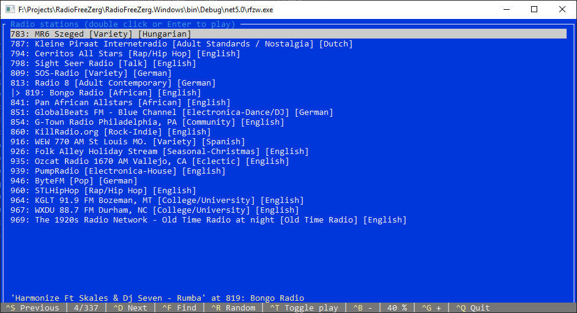

# What is this?
This console app is a list of radio station audio streams you can play via terminal interface with the help of `vlclib`:

It is a quite basic app I wrote for fun and personal use, but maybe someone would be interested in it, who knows.

## How to use it?
By default the entire database is displayed. Radio stations are presented in `id: title [genre] [language]` format.

You can:
* list only stations with certain keywords in title/description with `Find` command,
* reset the search by searching for empty string,
* navigate the resulting list with `Previous`/`Next`,
* play the desired radio station with double-clicking the list item or pressing `Enter` with the list item focused.
* play/pause current station with `Toggle play`,
* play random station from the current list with `Random`,
* control the volume with `-`/`+`.

All available controls are listed in the status bar along with their shortcuts. `^` symbol represents `Ctrl` key, for example `^S` means `Ctrl+S`.
In order to trigger command, you can press the hotkey or click status bar item with the mouse.

## Does it work on Linux?
Never actually checked, sorry about that. You will definitely need to install some prerequisites, see [RadioFreeZerg.Linux/README.md](RadioFreeZerg.Linux/README.md).

## Where were radio stations stream sources taken from?
Radio stations were parsed from [CuteRadio](http://marxoft.co.uk/projects/cuteradio-api/) and checked for availability with a small sub-app in the `CuteRadioParser` folder.
Resulting radio station database is located in the `stations.json` file.